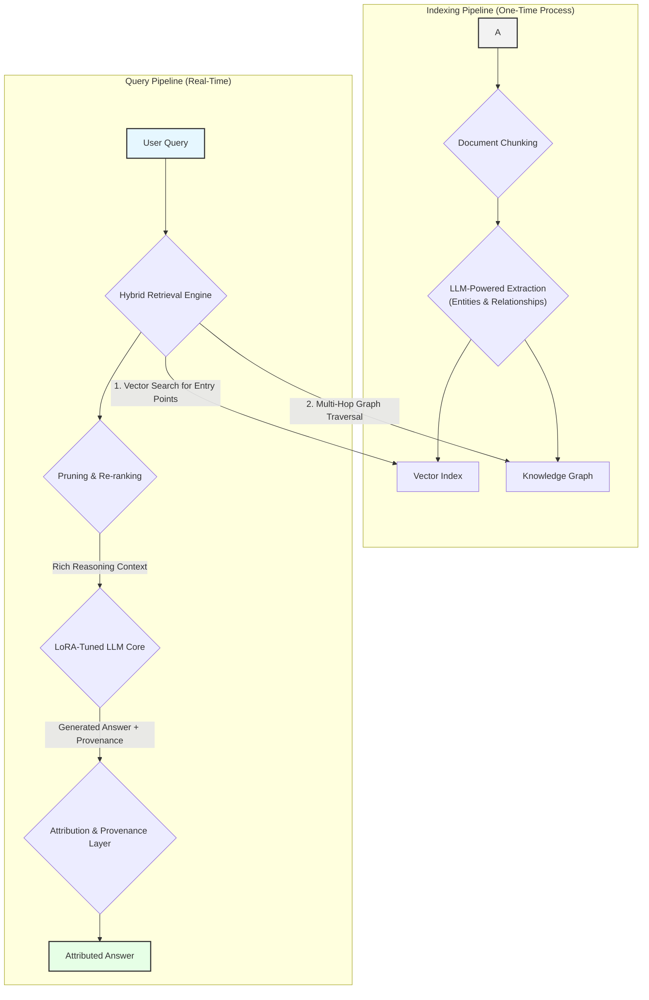
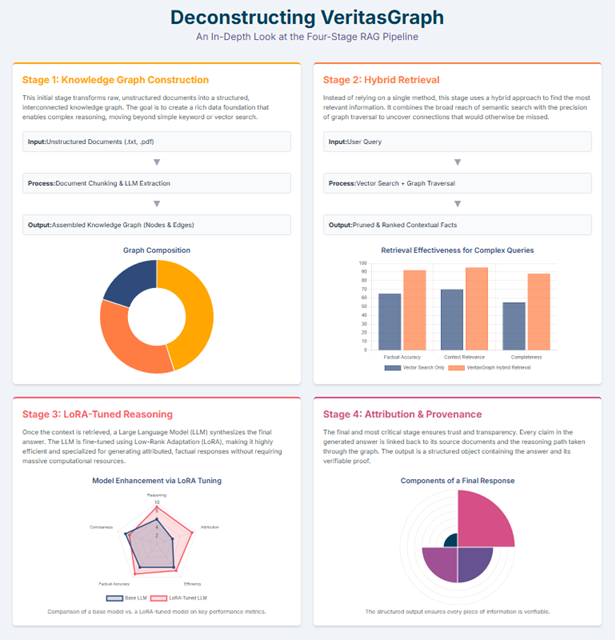

# VeritasGraph  
**Enterprise-Grade Graph RAG for Secure, On-Premise AI with Verifiable Attribution**


[](https://opensource.org/licenses/MIT)

VeritasGraph is a production-ready, end-to-end framework for building advanced question-answering and summarization systems that operate entirely within your private infrastructure.  

It is architected to overcome the fundamental limitations of traditional vector-search-based Retrieval-Augmented Generation (RAG) by leveraging a knowledge graph to perform complex, multi-hop reasoning.  

Baseline RAG systems excel at finding direct answers but falter when faced with questions that require connecting disparate information or understanding a topic holistically. **VeritasGraph addresses this challenge directly, providing not just answers, but transparent, auditable reasoning paths with full source attribution for every generated claim, establishing a new standard for trust and reliability in enterprise AI.**

---
## Why VeritasGraph?

### ✅ Fully On-Premise & Secure
Maintain **100% control** over your data and AI models, ensuring maximum security and privacy.

### ✅ Verifiable Attribution
Every generated claim is **traced back** to its source document, guaranteeing transparency and accountability.

### ✅ Advanced Graph Reasoning
Answer **complex, multi-hop questions** that go beyond the capabilities of traditional vector search engines.

### ✅ Open-Source & Sovereign
Build a **sovereign knowledge asset**, free from vendor lock-in, with full ownership and customization.

## 🚀 Demo  

### Video Walkthrough  
A brief video demonstrating the core functionality of VeritasGraph, from data ingestion to multi-hop querying with full source attribution.  

[](https://drive.google.com/file/d/1lEmAOUCLV0h98kY-ars96SNf5O6lVmiY/view?usp=sharing)  

 
---

### System Architecture Screenshot  
The following diagram illustrates the end-to-end pipeline of the VeritasGraph system:  
 


 
---
## Five-Minute Magic Onboarding (Docker)

Clone the repo and run a full VeritasGraph stack (Ollama + Neo4j + Gradio app) with one command:

1. Update `docker/five-minute-magic-onboarding/.env` with your Neo4j password (defaults for the rest).
2. From the same folder run:
    ```bash
    cd docker/five-minute-magic-onboarding
    docker compose up --build
    ```
3. Services exposed:
    - Gradio UI: http://127.0.0.1:7860/
    - Neo4j Browser: http://localhost:7474/
    - Ollama API: http://localhost:11434/

See `docker/five-minute-magic-onboarding/README.md` for deeper details.

---
# Guide to build graphrag with local LLM
 

 
## Environment
I'm using Ollama ( llama3.1) on Windows and  Ollama (nomic-text-embed) for text embeddings
 
Please don't use WSL if you use LM studio for embeddings because it will have issues connecting to the services on Windows (LM studio)
 
### IMPORTANT! Fix your model context length in Ollama
 
Ollama's default context length is 2048, which might truncate the input and output when indexing
 
I'm using 12k context here (10*1024=12288), I tried using 10k before, but the results still gets truncated
 
**Input / Output truncated might get you a completely out of context report in local search!!**
 
Note that if you change the model in `setttings.yaml` and try to reindex, it will restart the whole indexing!
 
First, pull the models we need to use
 
```
ollama serve
# in another terminal
ollama pull llama3.1
ollama pull nomic-embed-text
```
 
Then build the model with the `Modelfile` in this repo
```
ollama create llama3.1-12k -f ./Modelfile
```
 
## Steps for GraphRAG Indexing
First, activate the conda enviroment
```
conda create -n rag python=<any version below 3.12>
conda activate rag
```
 
Clone this project then cd the directory
```
cd graphrag-ollama-config
```
 
Then pull the code of graphrag (I'm using a local fix for graphrag here) and install the package
```
cd graphrag-ollama
pip install -e ./
 
```
 
You can skip this step if you used this repo, but this is for initializing the graphrag folder
```
pip install sympy
pip install future
pip install ollama
python -m graphrag.index --init --root .
```
 
Create your `.env` file
```
cp .env.example .env
```
 
Move your input text to `./input/`
 
Double check the parameters in `.env` and `settings.yaml`, make sure in `setting.yaml`,
it should be "community_reports" instead of "community_report"
 
Then finetune the prompts (this is important, this will generate a much better result)
 
You can find more about how to tune prompts [here](https://microsoft.github.io/graphrag/posts/prompt_tuning/auto_prompt_tuning/)
```
python -m graphrag.prompt_tune --root . --domain "Christmas" --method random --limit 20 --language English --max-tokens 2048 --chunk-size 256  --no-entity-types --output ./prompts
```
 
Then you can start the indexing
```
python -m graphrag.index --root .
```
 
You can check the logs in `./output/<timestamp>/reports/indexing-engine.log` for errors
 
Test a global query
```
python -m graphrag.query \
--root . \
--method global \
"What are the top themes in this story?"
```
 
## Using the UI
 
First, make sure requirements are installed
```
pip install -r requirements.txt
```
 
Then run the app using
```
gradio app.py
```
 
To use the app, visit http://127.0.0.1:7860/
 
## 📑 Table of Contents  

- [Core Capabilities](#1-core-capabilities)  
- [The Architectural Blueprint](#2-the-architectural-blueprint-from-unstructured-data-to-attributed-insights)  
- [Beyond Semantic Search](#3-beyond-semantic-search-solving-the-multi-hop-challenge)  
- [Secure On-Premise Deployment Guide](#4-secure-on-premise-deployment-guide)  
- [API Usage & Examples](#5-api-usage--examples)  
- [Project Philosophy & Future Roadmap](#6-project-philosophy--future-roadmap)  
- [Acknowledgments & Citations](#7-acknowledgments--citations)  

---

## 1. Core Capabilities  

VeritasGraph integrates four critical components into a cohesive, powerful, and secure system:  

- **Multi-Hop Graph Reasoning** – Move beyond semantic similarity to traverse complex relationships within your data.  
- **Efficient LoRA-Tuned LLM** – Fine-tuned using Low-Rank Adaptation for efficient, powerful on-premise deployment.  
- **End-to-End Source Attribution** – Every statement is linked back to specific source documents and reasoning paths.  
- **Secure & Private On-Premise Architecture** – Fully deployable within your infrastructure, ensuring data sovereignty.  

---

## 2. The Architectural Blueprint: From Unstructured Data to Attributed Insights  

The VeritasGraph pipeline transforms unstructured documents into a structured knowledge graph for attributable reasoning.  

### **Stage 1: Automated Knowledge Graph Construction**  
- **Document Chunking** – Segment input docs into granular `TextUnits`.  
- **Entity & Relationship Extraction** – LLM extracts structured triplets `(head, relation, tail)`.  
- **Graph Assembly** – Nodes + edges stored in a graph database (e.g., Neo4j).  

### **Stage 2: The Hybrid Retrieval Engine**  
- **Query Analysis & Entry-Point Identification** – Vector search finds relevant entry nodes.  
- **Contextual Expansion via Multi-Hop Traversal** – Graph traversal uncovers hidden relationships.  
- **Pruning & Re-Ranking** – Removes noise, keeps most relevant facts for reasoning.  

### **Stage 3: The LoRA-Tuned Reasoning Core**  
- **Augmented Prompting** – Context formatted with query, sources, and instructions.  
- **LLM Generation** – Locally hosted, LoRA-tuned open-source model generates attributed answers.  
- **LoRA Fine-Tuning** – Specialization for reasoning + attribution with efficiency.  

### **Stage 4: The Attribution & Provenance Layer**  
- **Metadata Propagation** – Track source IDs, chunks, and graph nodes.  
- **Traceable Generation** – Model explicitly cites sources.  
- **Structured Attribution Output** – JSON object with provenance + reasoning trail.  

---

## 3. Beyond Semantic Search: Solving the Multi-Hop Challenge  

Traditional RAG fails at complex reasoning (e.g., linking an engineer across projects and patents).  
VeritasGraph succeeds by combining:  

- **Semantic search** → finds entry points.  
- **Graph traversal** → connects the dots.  
- **LLM reasoning** → synthesizes final answer with citations.  

---

## 4. Secure On-Premise Deployment Guide  

### **Prerequisites**  

**Hardware**  
- CPU: 16+ cores  
- RAM: 64GB+ (128GB recommended)  
- GPU: NVIDIA GPU with 24GB+ VRAM (A100, H100, RTX 4090)  

**Software**  
- Docker & Docker Compose  
- Python 3.10+  
- NVIDIA Container Toolkit  

### **Configuration**  
- Copy `.env.example` → `.env`  
- Populate with environment-specific values  

## 6. Project Philosophy & Future Roadmap
### **Philosophy**  

VeritasGraph is founded on the principle that the most powerful AI systems should also be the most transparent, secure, and controllable.

The project's philosophy is a commitment to democratizing enterprise-grade AI, providing organizations with the tools to build their own sovereign knowledge assets.

This stands in contrast to reliance on opaque, proprietary, cloud-based APIs, empowering organizations to maintain full control over their data and reasoning processes.

### **Roadmap**  

**Planned future enhancements include:**

- Expanded Database Support – Integration with more graph databases and vector stores.

- Advanced Graph Analytics – Community detection and summarization for holistic dataset insights (inspired by Microsoft’s GraphRAG).

- Agentic Framework – Multi-step reasoning tasks, breaking down complex queries into sub-queries.

- Visualization UI – A web interface for graph exploration and attribution path inspection.

## 7. Acknowledgments & Citations

This project builds upon the foundational research and open-source contributions of the AI community.

We acknowledge the influence of the following works:

- HopRAG – pioneering research on graph-structured RAG and multi-hop reasoning.

- Microsoft GraphRAG – comprehensive approach to knowledge graph extraction and community-based reasoning.

- LangChain & LlamaIndex – robust ecosystems that accelerate modular RAG system development.

- Neo4j – foundational graph database technology enabling scalable Graph RAG implementations.

## Deconstructing VeritasGraph

[](https://bibinprathap.github.io/VeritasGraph/index.html)

**[➡️ Click here to view the Four-Stage](https://bibinprathap.github.io/VeritasGraph/index.html)**

## Star History
 
[](https://www.star-history.com/#bibinprathap/VeritasGraph&Date)


 


