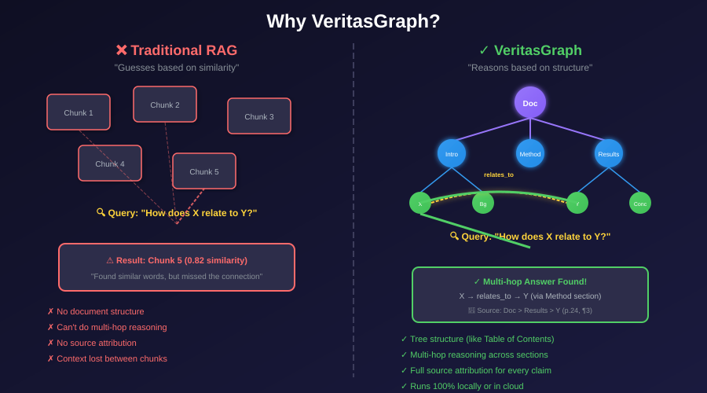
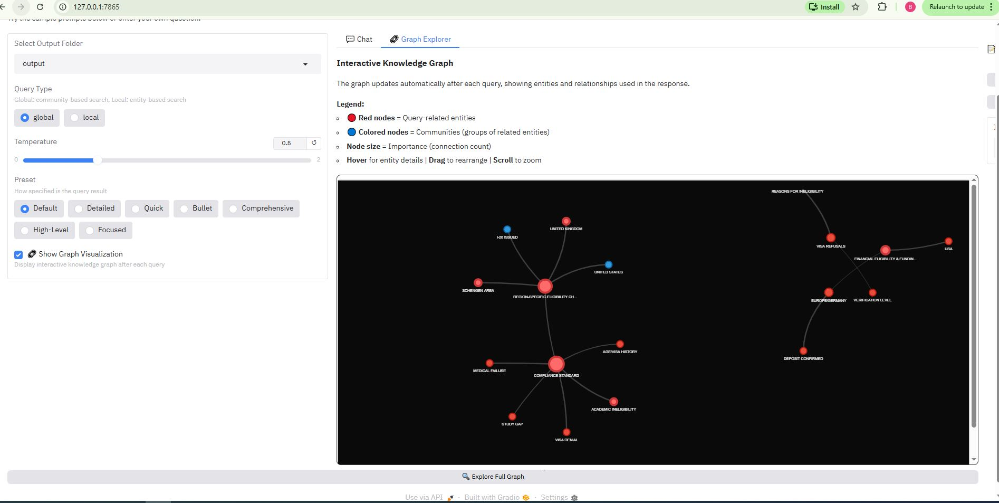
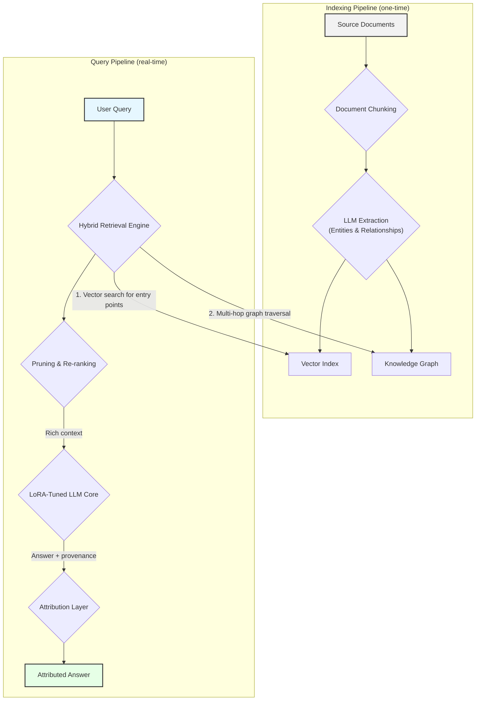

# VeritasGraph — The Governed, On-Prem GraphRAG & Agent Framework

**Stop chunking blindly. Combine Tree-Search structure with Knowledge-Graph reasoning — and wire it into governed AI agents. Runs 100% locally or in the cloud.**


[](https://badge.fury.io/py/veritasgraph)
[](https://www.python.org/downloads/)
[](https://opensource.org/licenses/MIT)
[](https://github.com/bibinprathap/VeritasGraph/actions)
[](https://github.com/bibinprathap/VeritasGraph)

> **🎯 Traditional RAG guesses based on similarity. VeritasGraph reasons based on structure.**
> Don't just find the document — understand the connection, then act on it with governed agents.

⭐ [Star](https://github.com/bibinprathap/VeritasGraph) · 🍴 [Fork](https://github.com/bibinprathap/VeritasGraph/fork) · 💬 [Discuss](https://github.com/bibinprathap/VeritasGraph/discussions) · 🐛 [Report a bug](https://github.com/bibinprathap/VeritasGraph/issues)

---

## 📚 Featured Guide — Build Governed AI Agents On-Prem

A complete walkthrough of designing, wiring, and shipping governed AI agents entirely on your own infrastructure.

**[📄 Read the guide: *Build Governed AI Agents On-Prem* (PDF)](https://github.com/bibinprathap/VeritasGraph/blob/restored-main/Build-Governed-AI-Agents-On-Prem.pdf)**

[](https://youtu.be/sA7ReEgdJfg)
[](https://youtu.be/Po2Z6QtqFks)
> ▶️ **[Watch the walkthrough on YouTube](https://youtu.be/sA7ReEgdJfg)**

---

## 🚀 Quick Start (2 lines, no GPU)

```bash
pip install veritasgraph
veritasgraph demo --mode=lite
```

That's it — an interactive demo using cloud APIs (OpenAI/Anthropic), no local models required.

| Mode | Best For | Requirements |
|------|----------|--------------|
| `--mode=lite` | Quick demo, no GPU | OpenAI/Anthropic API key |
| `--mode=local` | Privacy, offline use | Ollama + 8GB RAM |
| `--mode=full` | Production, all features | Docker + Neo4j |

```bash
export OPENAI_API_KEY="sk-..."        # Lite: cloud APIs, zero setup
veritasgraph demo --mode=lite

veritasgraph demo --mode=local --model=llama3.2   # 100% offline with Ollama
veritasgraph start --mode=full                    # full GraphRAG pipeline
```

<p align="center">
  <a href="https://colab.research.google.com/github/bibinprathap/VeritasGraph/blob/restored-main/graphrag-ollama-config/cookbook/veritasgraph_demo.ipynb"></a>
  &nbsp;
  <a href="https://colab.research.google.com/github/bibinprathap/VeritasGraph/blob/restored-main/graphrag-ollama-config/cookbook/vision_native_rag.ipynb"></a>
  &nbsp;
  <a href="https://colab.research.google.com/github/bibinprathap/VeritasGraph/blob/restored-main/cookbook/test_hierarchical_tree_accuracy.ipynb"></a>
</p>

**Useful links:** [⚡ Live docs](https://bibinprathap.github.io/VeritasGraph/index.html) · [🎮 Live demo](https://bibinprathap.github.io/VeritasGraph/demo/) · [📖 Article](https://medium.com/@bibinprathap/beyond-vector-search-building-trustworthy-enterprise-ai-with-the-veritasgraph-rag-pipeline-53fc8e9e8ff9) · [📄 Research paper](VeritasGraph%20-%20A%20Sovereign%20GraphRAG%20Framework%20for%20Enterprise-Grade%20AI%20with%20Verifiable%20Attribution.pdf)

---

## 🛠️ VeritasGraph Studio — Build, wire & test governed agents locally

**Studio** is a local Agent Build Workspace (FastAPI + single-page UI) that lets you build a knowledge graph from your own documents and **wire it into agents** alongside tools, memory, data logging, guardrails, and headroom-style context budgeting — then chat with those agents live and watch every stage of the orchestration pipeline. Everything runs **100% locally** against [Ollama](https://ollama.com).


> **[🎮 Try the Studio Live](https://bibinprathap.github.io/VeritasGraph/studio/)** — *stable URL that always redirects to the current running studio tunnel.*

**Run it:**

```bash
pip install -r requirements.txt
ollama serve & ollama pull qwen3:latest          # any local chat model
STUDIO_DATA_DIR="$PWD/studio_api/data" \
  uvicorn studio_api.main:app --host 127.0.0.1 --port 8200 --log-level warning
# Studio UI → http://localhost:8200/studio   ·   API docs → /docs
```

**One-command end-to-end demo** (builds a graph + drives a fully-wired agent through graph reasoning, memory recall, PII redaction, and a guardrail block):

```bash
python3 demos/agent-studio/sample_pipeline.py --model qwen3:latest
```

<details>
<summary><b>What's inside — full Studio feature set</b></summary>

- 🧩 **Knowledge Graph builder & explorer** — ingest text, extract entities/relationships locally, inspect nodes/edges with grounded evidence.
- 🔎 **Graph Q&A with citations** — multi-hop answers backed by `[doc#chunk]` source attribution.
- 🤖 **Agent workspace** — create/edit agents with model selection, prompt/persona settings, and per-agent capability toggles.
- 🔀 **Governed orchestration pipeline** — per-turn flow of Guardrails → Memory → Knowledge Graph → Headroom budget → Tools → Data log, with full trace visibility.
- 🧰 **Editable tools catalog** — add, edit, enable/disable, test, and delete tools directly in Studio.
- 🌐 **External real tool support** — call real HTTP endpoints with configurable method, auth header, and custom headers.
- 🔌 **MCP bridge integrations** — local MCP proxy connectors (e.g. Chrome DevTools MCP, Unity MCP) with health-aware probing.
- 🛡️ **Guardrails** — PII redaction and policy-block controls with visible guardrail-block metrics.
- 🧠 **Memory + Data logs** — per-agent short-term memory and interaction-log persistence.
- 📈 **Evaluation & fine-tune simulation** — run eval suites, track pass-rate trends, and queue/monitor fine-tune jobs.
- 💬 **Playground** — run governed agent conversations live and inspect the pipeline trace.
- 📊 **KPI dashboard** — active agents, connected tools, eval pass rate, and guardrail-block counters.

See [`studio_api/README.md`](studio_api/README.md) for API and architecture, and [`docs/STUDIO_ENTERPRISE_TEST.md`](docs/STUDIO_ENTERPRISE_TEST.md) for enterprise test scenarios.

</details>

### 📋 Examples

| # | Example | What it demonstrates | Run |
|---|---------|---------------------|-----|
| 1 | [`sample_pipeline.py`](demos/agent-studio/sample_pipeline.py) | **Studio agent pipeline** — ingests a company brief → builds KG → multi-hop Q&A with citations → memory recall → PII redaction → guardrail block → audit log. | `python3 demos/agent-studio/sample_pipeline.py` |
| 2 | [`sample_tools_explorer.py`](demos/agent-studio/sample_tools_explorer.py) | **Tool catalog seeder** — registers 17 tools and creates sample explorer agents. Idempotent. | `python3 demos/agent-studio/sample_tools_explorer.py` |
| 3 | [`clinical-kg/`](clinical-kg/) | **Medical AI — Clinical Knowledge Graph** — de-identifies notes (Safe Harbor), extracts entities, detects contradictions, normalizes to ICD-10/RxNorm/SNOMED/LOINC, builds patient KG with citations. | `cd clinical-kg/backend && python run.py` |
| 4 | [`municipality-incident-chatbot/`](municipality-incident-chatbot/) | **DMT Inspection System** — citizen incident reporting with CV validation (YOLO/VLM), KG-grounded routing, evidence fusion, case registration. | `cd municipality-incident-chatbot && python cli.py` |

<details>
<summary><b>🏥 Example 3 — Medical AI: HIPAA-Safe Clinical Knowledge Graph</b></summary>

> Turn unstructured clinical notes into a governed, citable knowledge graph — fully on-prem.

**The 7-step pipeline:**

| Step | What it does |
|------|--------------|
| **De-identify** | Safe Harbor regex redaction with a sealed `SurrogateVault` for audited re-identification |
| **Extract** | Section-aware NER, med-sig / lab-value parsing, ConText axes (negation, certainty, temporality, experiencer) |
| **Reconcile** | Groups mentions by concept; detects contradictions across notes (e.g. *"no diabetes"* in HPI vs *"T2DM"* in problem list) |
| **Normalize** | Maps mentions → coded concepts (ICD-10-CM, RxNorm, SNOMED CT, LOINC) |
| **Knowledge Graph** | Patient / Encounter / Condition / Medication / LabResult nodes with `EVIDENCED_BY` provenance edges |
| **Query** | NL → structured `CohortQuery` → multi-hop traversal with `[doc#chunk]` citations |
| **Governance** | k-anonymity over released cohorts |

```bash
# Backend (FastAPI on :8300)
cd clinical-kg/backend
pip install -r requirements.txt
python run.py

# Frontend (Next.js dashboard on :3200)
cd clinical-kg/frontend
npm install && npm run dev
```

Open **http://localhost:3200** → click **Load sample notes** → run queries. The UI has 6 tabs: Cohort Query, Ingest Note, Patients, Contradictions, Graph, Re-ID Risk.

</details>

<details>
<summary><b>🏛️ Example 4 — DMT Inspection System: Municipality Incident Chatbot</b></summary>

> AI chatbot for citizens to report civic incidents, validated by computer vision and grounded by a knowledge graph.

**Pipeline flow:** citizen photo + description → KG classification → CV validation (YOLO/VLM) → cross-check (CCTV, location, prior reports) → evidence fusion → case registration.

**Supported incidents:** trash overflow · abandoned vehicles · overcrowding · illegal parking *(extensible)*

```bash
cd municipality-incident-chatbot
pip install -r requirements.txt

# Interactive CLI
python cli.py
#   you> trash overflowing near the market | photo=garbage_overflow.jpg | zone=downtown

# Test suite
python -m pytest -q
```

| Component | File |
|-----------|------|
| Knowledge graph (grounding + routing) | [`app/knowledge_graph.py`](municipality-incident-chatbot/app/knowledge_graph.py) |
| CV validation (YOLO + VLM) | [`app/cv_service.py`](municipality-incident-chatbot/app/cv_service.py) |
| Evidence fusion & scoring | [`app/fusion.py`](municipality-incident-chatbot/app/fusion.py) |
| Chatbot orchestrator | [`app/orchestrator.py`](municipality-incident-chatbot/app/orchestrator.py) |
| Architecture docs | [`01_architecture.md`](municipality-incident-chatbot/01_architecture.md) |

</details>

**Enterprise scenario** — follow the [Northwind Bank compliance test playbook](docs/STUDIO_ENTERPRISE_TEST.md) for a guided walkthrough using realistic financial-services data.

For API-level examples and curl recipes, see [`studio_api/README.md`](studio_api/README.md).

</details>

---

## 🌳 + 🔗 Graph + Tree: the ultimate retrieval

**Why choose?** VeritasGraph includes the hierarchical "Table of Contents" navigation of PageIndex **PLUS** the semantic reasoning of a Knowledge Graph.

```
Document Root
├── [1] Introduction
│   ├── [1.1] Background ←── Tree Navigation
│   └── [1.2] Objectives
├── [2] Methodology ←───────── Graph Links
│   └── relates_to ──────────→ [3.1] Findings
└── [3] Results
```

### 📊 Feature comparison

| Feature | Vector RAG | PageIndex | **VeritasGraph** |
|---------|:----------:|:---------:|:----------------:|
| **Retrieval type** | Similarity | Tree search | 🏆 Tree + Graph reasoning |
| **Attribution** | ❌ Low | ⚠️ Medium | ✅ **100% verifiable** |
| **Multi-hop reasoning** | ❌ | ❌ | ✅ |
| **Tree navigation (TOC)** | ❌ | ✅ | ✅ |
| **Semantic search** | ✅ | ❌ | ✅ |
| **Cross-section linking** | ❌ | ❌ | ✅ |
| **Visual graph explorer** | ❌ | ❌ | ✅ **Built-in UI** |
| **100% local/private** | ⚠️ Varies | ❌ Cloud | ✅ **On-premise** |
| **Open source** | ⚠️ Varies | ❌ Proprietary | ✅ **MIT license** |

<p align="center">
  
</p>

---

## 🎬 See it in action

[](https://youtu.be/oa8ektm7nLY)

<p align="center">
  <a href="https://youtu.be/NGVDQbkY1wE"></a>
  &nbsp;
  <a href="https://www.youtube.com/watch?v=8fz8RWgL04Y"></a>
</p>

> **💡 What you're seeing:** a query triggers multi-hop reasoning across the knowledge graph. Nodes light up as connections are discovered, showing exactly *how* the answer was found — not just *what* was found.

---

## 🔌 MCP Server — connect your IDE agent to VeritasGraph

VeritasGraph ships a dedicated **[Model Context Protocol](https://modelcontextprotocol.io/) server** — *the first zero-trust, air-gapped Enterprise GraphRAG server for MCP.* Connect Claude Desktop, Cursor, VS Code, Windsurf, Cline, or Continue directly to the GraphRAG engine over JSON-RPC 2.0 stdio, with **zero external data egress**.

```bash
python -m veritasgraph_mcp     # from repo root (needs local Ollama for ingest/query)
```

Tools: `veritasgraph_ingest_document`, `veritasgraph_query` (multi-hop answers with `[doc#chunk]` citations), `veritasgraph_search_entities`, `veritasgraph_get_graph`, `veritasgraph_clear_graph`. See [`veritasgraph_mcp/README.md`](veritasgraph_mcp/README.md) for IDE registration snippets.

---

## 📖 Python API

```python
from veritasgraph import VisionRAGPipeline

pipeline = VisionRAGPipeline()                 # auto-detects available models
doc = pipeline.ingest_pdf("document.pdf")
result = pipeline.query("What are the key findings?")
print(result.answer)
```

<details>
<summary><b>🌳 Hierarchical tree navigation + graph search</b></summary>

```python
from veritasgraph import VisionRAGPipeline

pipeline = VisionRAGPipeline()
doc = pipeline.ingest_pdf("report.pdf")

# View the document's hierarchical structure (like a Table of Contents)
print(pipeline.get_document_tree())
# Document Root
# ├── [1] Introduction (pp. 1-5)
# │   ├── [1.1] Background (pp. 1-2)
# │   └── [1.2] Objectives (pp. 3-5)
# └── [2] Methodology (pp. 6-15)

# Navigate to a specific section (tree-based retrieval)
section = pipeline.navigate_to_section("Methodology")
print(section['breadcrumb'])   # ['Document Root', 'Methodology']

# Or use graph-based semantic search
result = pipeline.query("What methodology was used?")
# → answer with section context: "📍 Location: Document > Methodology > Analysis Framework"
```

</details>

<details>
<summary><b>🔧 Custom configuration & ingestion modes</b></summary>

```python
from veritasgraph import VisionRAGPipeline, VisionRAGConfig

config = VisionRAGConfig(ingest_mode="document-centric")  # tables stay intact!
pipeline = VisionRAGPipeline(config)
doc = pipeline.ingest_pdf("annual_report.pdf")
```

| Mode | Description | Best For |
|------|-------------|----------|
| `document-centric` | Whole pages/sections as nodes (default) | Most documents |
| `page` | Each page = one node | Slide decks, reports |
| `section` | Each section = one node | Structured documents |
| `chunk` | Traditional 500-token chunks | Legacy compatibility |

</details>

### CLI

```bash
veritasgraph --version                                    # show version
veritasgraph info                                         # check dependencies
veritasgraph init my_project                              # initialize a project
veritasgraph ingest document.pdf --ingest-mode=document-centric   # Don't Chunk. Graph.
veritasgraph ingest https://youtube.com/watch?v=xxx       # auto-extract transcript
veritasgraph ingest https://example.com/article           # extract web article
```

### Installation options

```bash
pip install veritasgraph            # basic (includes lite mode)
pip install veritasgraph[web]       # Gradio UI + visualization
pip install veritasgraph[graphrag]  # Microsoft GraphRAG integration
pip install veritasgraph[ingest]    # YouTube & web-article ingestion
pip install veritasgraph[all]       # everything
```

---

## 🏛️ Enterprise Compliance — VeritasGraph + VeritasReason

GraphRAG is brilliant at *describing* what your documents say. But enterprise questions like **"Which purchase orders violated our Segregation-of-Duties policy last quarter?"** are **rule-evaluation problems** over structured records — not similarity search.

For those, VeritasGraph ships a sister module: **[VeritasReason](veritas-reason/README_VERITASREASON.md)** — a deterministic reasoning engine (forward-chaining + Rete + SPARQL) that fires policy rules over a triplet store and returns auditable answers with W3C PROV-O provenance.

```
 Policy PDFs ─┐                        ┌─ ingest_structured.py (SQL → triples + text)
              ▼                        ▼
      VeritasGraph GraphRAG      VeritasReason (TripletStore + RuleSet
      (quotes policy text)       + ForwardChainer + PROV-O)
              └──────────┬───────────────┘
                         ▼
             Compliance answer + violators table + clause citations
```

### 30-second smoke test (no install, stdlib only)

```bash
python tests/test_policy_compliance_demo.py
```

Seeds a fake ERP into a tiny in-memory triple store, evaluates four SoD rules from [rules/sod_policy.yaml](rules/sod_policy.yaml), and prints violators with citations:

```
✓ Reasoner fired. Detected 4 violation(s):
  po:PO-2204 SOD-01   Approved & paid by emp:E118
  po:PO-2301 SOD-02   Requested & approved by emp:E091
  po:PO-2317 SOD-03   $48,750.00 approved by emp:E091 (role:Manager, not Director)
  po:PO-2402 SOD-04   Vendor vendor:V77 related to approver emp:E140
```

Or install and run the packaged demo:

```bash
pip install veritas-reason
veritasreason-policy-demo
```

<p align="center">
  
</p>

The same pattern applies to leave-policy violations (HRIS attendance), expense-report fraud (ledger + receipts), clinical protocol breaches (EHR + guidelines), or KYC/AML (transactions + watchlists). Define the SQL → triple mapping in [ingest_structured.py](graphrag-ollama-config/ingest_structured.py), write rules in `rules/*.yaml`, and ask in plain English. See [veritas-reason/plan.md](veritas-reason/plan.md) for a full walk-through.

---

## 🔗 Interactive Graph Visualization

VeritasGraph includes an **interactive 2D knowledge-graph explorer** (PyVis) that visualizes entities and relationships in real time.



| Feature | Description |
|---------|-------------|
| **Query-aware subgraph** | Shows only entities related to your query |
| **Community coloring** | Nodes grouped by community membership |
| **Red highlight** | Query-related entities shown in red |
| **Node sizing** | Bigger nodes = more connections |
| **Interactive** | Drag, zoom, hover for entity details |
| **Full graph explorer** | View the entire knowledge graph |

---

## ⚙️ Provider Support (OpenAI-compatible)

VeritasGraph works with **any OpenAI-compatible API** — mix and match cloud and local:

| Provider | API Base | API Key | Example Model |
|----------|----------|---------|---------------|
| **Ollama** (default) | `http://localhost:11434/v1` | `ollama` | `llama3.1-12k` |
| **OpenAI** | `https://api.openai.com/v1` | `sk-proj-...` | `gpt-4-turbo-preview` |
| **Groq** | `https://api.groq.com/openai/v1` | `gsk_...` | `llama-3.1-70b-versatile` |
| **Together AI** | `https://api.together.xyz/v1` | your-key | `Meta-Llama-3.1-70B-Instruct-Turbo` |
| **LM Studio** | `http://localhost:1234/v1` | `lm-studio` | (model loaded in LM Studio) |

Also supported: Azure OpenAI, OpenRouter, Anyscale, LocalAI, vLLM.

```bash
cd graphrag-ollama-config
cp settings_openai.yaml settings.yaml
cp .env.openai.example .env       # edit with your provider settings
python -m graphrag.index --root . --config settings_openai.yaml
python app.py
```

> ⚠️ **Embeddings must match your index.** If you indexed with `nomic-embed-text` (768 dims), you must query with the same model — switching embedding models requires **re-indexing**. Full details in [OPENAI_COMPATIBLE_API.md](graphrag-ollama-config/OPENAI_COMPATIBLE_API.md).

---

## 🐳 Deployment

### Five-Minute Magic Onboarding (Docker)

Run a full stack (Ollama + Neo4j + Gradio) with one command:

```bash
cd docker/five-minute-magic-onboarding
# set your Neo4j password in .env, then:
docker compose up --build
```

Services: Gradio UI → http://127.0.0.1:7860 · Neo4j → http://localhost:7474 · Ollama → http://localhost:11434. See [`docker/five-minute-magic-onboarding/README.md`](docker/five-minute-magic-onboarding/README.md).

### Share with your team (free)

| Method | Duration | Local Ollama | Setup | Best For |
|--------|----------|:------------:|-------|----------|
| `python app.py --share` | 72 hours | ✅ | 1 min | Quick demos |
| Ngrok tunnel | Unlimited* | ✅ | 5 min | Team evaluation |
| Cloudflare tunnel | Unlimited* | ✅ | 5 min | Team evaluation |
| Hugging Face Spaces | Permanent | ❌ (cloud LLM) | 15 min | Public showcase |

_*Free tier has some limitations._

---

## 🏗️ Architecture


```mermaid
graph TD
    subgraph "Indexing Pipeline (one-time)"
        A[Source Documents] --> B{Document Chunking};
        B --> C{"LLM Extraction<br/>(Entities & Relationships)"};
        C --> D[Vector Index];
        C --> E[Knowledge Graph];
    end
    subgraph "Query Pipeline (real-time)"
        F[User Query] --> G{Hybrid Retrieval Engine};
        G -- "1. Vector search for entry points" --> D;
        G -- "2. Multi-hop graph traversal" --> E;
        G --> H{Pruning & Re-ranking};
        H -- "Rich context" --> I{LoRA-Tuned LLM Core};
        I -- "Answer + provenance" --> J{Attribution Layer};
        J --> K[Attributed Answer];
    end
    style A fill:#f2f2f2,stroke:#333,stroke-width:2px
    style F fill:#e6f7ff,stroke:#333,stroke-width:2px
    style K fill:#e6ffe6,stroke:#333,stroke-width:2px
```

**The four stages:**

1. **Automated Knowledge Graph construction** — chunk documents into `TextUnits`, extract `(head, relation, tail)` triplets, assemble nodes + edges in a graph DB (e.g. Neo4j).
2. **Hybrid retrieval engine** — vector search finds entry nodes, multi-hop traversal uncovers hidden relationships, pruning & re-ranking keeps the most relevant facts.
3. **LoRA-tuned reasoning core** — a locally hosted, LoRA-tuned open model generates attributed answers with efficient fine-tuning for reasoning + attribution.
4. **Attribution & provenance layer** — propagates source IDs, chunks, and graph nodes into a structured, traceable JSON output.

<details>
<summary><b>On-premise prerequisites</b></summary>

**Hardware:** 16+ CPU cores · 64GB+ RAM (128GB recommended) · NVIDIA GPU with 24GB+ VRAM (A100 / H100 / RTX 4090).
**Software:** Docker & Docker Compose · Python 3.10+ · NVIDIA Container Toolkit.
Copy `.env.example` → `.env` and populate with environment-specific values.

</details>

---

## Why VeritasGraph?

- ✅ **Fully on-premise & secure** — 100% control over your data and models.
- ✅ **Verifiable attribution** — every claim traces back to its source.
- ✅ **Advanced graph reasoning** — answers complex, multi-hop questions.
- ✅ **Hierarchical tree + graph** — PageIndex-style TOC navigation with graph flexibility.
- ✅ **Governed agents** — guardrails, memory, tools, and context budgeting wired together in Studio.
- ✅ **Open-source & sovereign** — MIT-licensed, no vendor lock-in.

**Who is it for?** Engineers building enterprise search, compliance assistants, research copilots, scientific literature explorers, and agent memory systems — anywhere "the answer" depends on how facts *connect*, not just whether they appear near each other in a vector index.

---

## 🙌 Acknowledgments

Builds on the foundational work of **HopRAG**, **Microsoft GraphRAG**, **LangChain & LlamaIndex**, and **Neo4j**.

## 🏆 Awards & Citation

Presented at the **International Conference on Applied Science and Future Technology (ICASF 2025)** — [📄 Appreciation Certificate](ICASF%202025%20-%20Appreciation%20Certificate.pdf).

```bibtex
@article{VeritasGraph2025,
  title={VeritasGraph: A Sovereign GraphRAG Framework for Enterprise-Grade AI with Verifiable Attribution},
  author={Bibin Prathap},
  journal={International Conference on Applied Science and Future Technology (ICASF)},
  year={2025}
}
```

## Star History

[](https://star-history.dera.page/#bibinprathap/VeritasGraph&Date)

---

<p align="center">
  <a href="https://github.com/bibinprathap/VeritasGraph"></a>
  <a href="https://github.com/bibinprathap/VeritasGraph/issues"></a>
  <a href="https://github.com/bibinprathap/VeritasGraph/fork"></a>
  
  <a href="https://linkedin.com/in/bibin-prathap-4a34a489/"></a>
</p>

<p align="center"><b>Licensed under MIT.</b> ⭐ Star the repo to follow the roadmap for open-source, governed GraphRAG.</p>
