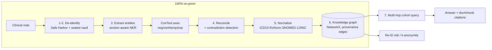

# Use Case 1 — HIPAA-Safe Clinical Knowledge Graph

A working, on-prem implementation of VeritasGraph **Use Case 1**: turn
unstructured clinical notes into a governed, citable knowledge graph — with
de-identification, contradiction detection, and multi-hop cohort queries — plus
a Next.js UI.

```
clinical-kg/
├── backend/          FastAPI + pipeline (Python, no heavy model downloads)
│   ├── clinical_kg/  the library (deid → extract → reconcile → graph → query)
│   ├── tests/        34 pytest tests
│   └── run.py        launches the API on :8300
└── frontend/         Next.js 14 dashboard on :3200
```

---

## Problem

~80% of US EHR data is unstructured free text. It cannot leave the network
(HIPAA), and facts contradict across notes (e.g., *"no diabetes"* in HPI vs.
*"T2DM"* in the problem list).

## Solution

OpenMed-style de-identification and entity extraction run **on-device**; an
assertion-graph reconciler merges mentions across note sections with
negation / certainty / experiencer / temporality axes and **flags
contradictions**; VeritasGraph ingests everything into a patient/cohort
knowledge graph with concepts normalized to **ICD-10-CM, RxNorm, SNOMED CT, and
LOINC**, and every fact carries a span-level `[doc#chunk]` citation.

---

## Architecture



### The 7-step pipeline (maps 1:1 to the plan)

| Step | Module | What it does |
|------|--------|--------------|
| 1–2. De-identify | [`deidentify.py`](backend/clinical_kg/deidentify.py) | Safe Harbor regex redaction; originals sealed in a `SurrogateVault` for audited re-identification |
| 3. Extract | [`extract.py`](backend/clinical_kg/extract.py) + [`context.py`](backend/clinical_kg/context.py) | Section segmentation, dictionary NER, med-sig / lab-value parsing, ConText axes |
| 4. Reconcile | [`assertion.py`](backend/clinical_kg/assertion.py) | Group mentions by concept; section authority resolves polarity; contradictions surfaced with both spans |
| 5. Normalize | [`normalize.py`](backend/clinical_kg/normalize.py) | Map mentions → coded concepts (SNOMED/ICD-10/RxNorm/LOINC) |
| 6. Load | [`graph.py`](backend/clinical_kg/graph.py) | Patient / Encounter / Condition / Medication / LabResult nodes + `EVIDENCED_BY` provenance |
| 7. Query | [`query.py`](backend/clinical_kg/query.py) | NL → structured `CohortQuery` → multi-hop traversal with citations |
| Governance | [`risk.py`](backend/clinical_kg/risk.py) | k-anonymity over released cohorts |

> **On-device vs. OpenMed:** the pipeline is deterministic and dependency-light
> so it runs offline with no model downloads. The de-id and NER stages share
> OpenMed's interface (`deidentify`, ConText axes, `assertion_graph`
> reconciliation, `risk/kanon`), so OpenMed's model-backed components can be
> dropped in without touching the graph or query layers.

---

## Run it

Both services are already wired together (the frontend proxies `/api/*` to the
backend).

### 1. Backend (Python)

```bash
cd clinical-kg/backend
pip install -r requirements.txt          # fastapi, uvicorn, networkx, pydantic, pytest, httpx
python run.py                            # -> http://127.0.0.1:8300  (docs at /docs)
```

### 2. Frontend (Next.js)

```bash
cd clinical-kg/frontend
npm install
npm run dev                              # -> http://localhost:3200
```

Open **http://localhost:3200**, click **Load sample notes**, then run the
flagship query. The UI has six tabs: **Cohort Query, Ingest Note, Patients,
Contradictions, Graph, Re-ID Risk**.

---

## Testing samples (from the use case)

Both are covered by the automated suite and reproducible in the UI.

```python
# 1) Contradiction across sections
note = """
HPI: Patient denies any history of diabetes.
Problem List: 1. Type 2 diabetes mellitus, on metformin 500mg BID.
"""
# Result: CONTRADICTION on Condition{snomed=44054006}; resolved = affirmed
# (Problem List authority > HPI); both spans retained.

# 2) Multi-hop cohort query
query = "List patients with T2DM taking metformin whose most recent eGFR < 30"
# Result (on bundled samples): P001 (eGFR 24) and P004 (eGFR 22),
# each with lab + med + condition span citations.
```

Run the tests:

```bash
cd clinical-kg/backend
python -m pytest            # 34 passed
```

Test files:
[test_deidentify.py](backend/tests/test_deidentify.py),
[test_extract.py](backend/tests/test_extract.py),
[test_assertion.py](backend/tests/test_assertion.py),
[test_graph_risk.py](backend/tests/test_graph_risk.py),
[test_query_pipeline.py](backend/tests/test_query_pipeline.py),
[test_api.py](backend/tests/test_api.py).

---

## API reference

| Method | Endpoint | Purpose |
|--------|----------|---------|
| GET  | `/health` | status + graph stats |
| POST | `/demo/load-samples` | ingest bundled synthetic notes |
| POST | `/ingest` | ingest notes (`{notes:[{doc_id,patient_id,text}]}`) |
| POST | `/query` | NL cohort query → matches + citations |
| GET  | `/patients` | patients + reconciled facts |
| GET  | `/contradictions` | reconciliation contradictions |
| GET  | `/graph?patient_id=` | cytoscape graph export |
| POST | `/risk/k-anonymity` | k-anonymity of a released cohort |
| POST | `/reset` | clear the in-memory graph |

---

## Success metrics

The targets below are the evaluation contract for this use case. The metrics
marked **(demo)** are exercised by the local test suite; the rest require
credentialed benchmark corpora (see Datasets) and are wired for evaluation but
not runnable without a signed DUA.

| Metric | Target | Method |
|--------|--------|--------|
| PHI de-identification recall | ≥ 0.99 (Safe Harbor) | i2b2 2014 de-ID corpus |
| Entity extraction F1 | ≥ 0.85 | 2010 i2b2 / n2c2 gold labels |
| Concept normalization accuracy | ≥ 0.90 | MedMentions / UMLS mapping |
| Contradiction detection precision | ≥ 0.80 | Manual clinician review sample |
| Citation attributability | 100% of asserted facts | **(demo)** every fact node has `EVIDENCED_BY` |
| Re-ID risk (k-anonymity) | k ≥ 5 for released cohorts | **(demo)** `risk.k_anonymity` |

## Available datasets

- **MIMIC-IV / MIMIC-III** (PhysioNet, credentialed) — real de-identified US ICU notes.
- **MIMIC-IV-Note** — free-text discharge summaries & radiology reports.
- **i2b2 / n2c2** (DBMI Data Portal, DUA) — de-ID, concept, relation, medication challenges.
- **MedMentions** — UMLS concept mentions for normalization eval.
- **eICU Collaborative Research Database** — multi-center US ICU data.

> **Compliance:** all bundled notes are **synthetic** (no real PHI). Never send
> PHI to cloud APIs — this stack is designed to run entirely on-prem.
