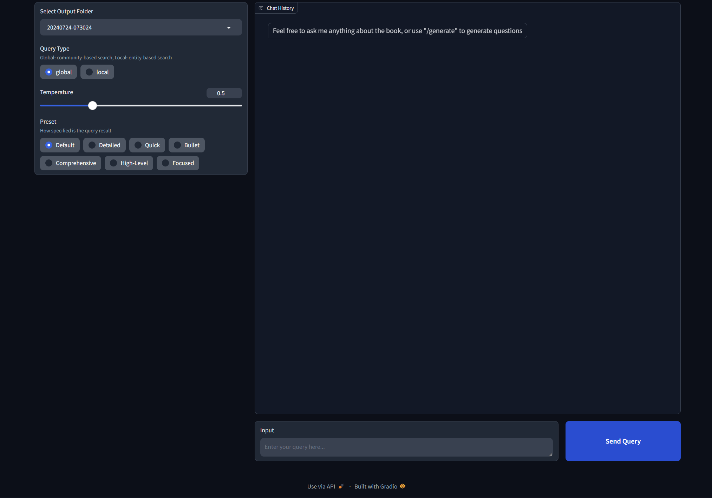

# Guide to build graphrag with local LLM
 

 
## Environment
This setup uses Ollama (llama3.1) and Ollama (nomic-embed-text) for text embeddings.

**Note**: This configuration has been updated to work with GraphRAG v0.3.6 for compatibility with the Gradio UI.
 
### IMPORTANT! Fix your model context length in Ollama
 
Ollama's default context length is 2048, which might truncate the input and output when indexing
 
I'm using 12k context here (10*1024=12288), I tried using 10k before, but the results still gets truncated
 
**Input / Output truncated might get you a completely out of context report in local search!!**
 
Note that if you change the model in `setttings.yaml` and try to reindex, it will restart the whole indexing!
 
First, pull the models we need to use
 
```
ollama serve
# in another terminal
ollama pull llama3.1
ollama pull nomic-embed-text
```
 
Then build the model with the `Modelfile` in this repo
```
ollama create llama3.1-12k -f ./Modelfile
```
 
## Steps for GraphRAG Indexing

### 1. Setup Conda Environment
```bash
conda create -n rag python=3.11
conda activate rag
```

### 2. Clone and Navigate to Directory
```bash
cd graphrag-ollama-config
```

### 3. Install GraphRAG v0.3.6
**IMPORTANT**: Use version 0.3.6 for compatibility with the Gradio UI
```bash
pip install graphrag==0.3.6
pip install sympy future ollama
```

### 4. Initialize GraphRAG (if not already done)
```bash
python -m graphrag.index --init --root .
```

### 5. Setup Environment Variables
Create a `.env` file with the following content:
```
GRAPHRAG_API_KEY=ollama
GRAPHRAG_LLM_MODEL=llama3.1-12k
GRAPHRAG_EMBEDDING_MODEL=nomic-embed-text
GRAPHRAG_LLM_API_BASE=http://localhost:11434/v1
GRAPHRAG_EMBEDDING_API_BASE=http://localhost:11434/v1
```

### 6. Add Input Data
Move your input text files to `./input/` directory

### 7. Verify Configuration
- Check `settings.yaml` - ensure it uses "community_reports" (not "community_report")
- Verify the file_pattern uses double dollar signs: `.*\\.txt$$`

### 8. Run Indexing
```bash
python -m graphrag.index --root .
```

The indexing process will:
- Create text units from your input files
- Extract entities and relationships
- Generate community reports
- Output artifacts to `./output/artifacts/`

Check logs at `./output/reports/indexing-engine.log` for any errors.
 
### 9. Prepare Output for Gradio UI
The Gradio UI expects timestamp-based folder structure. After indexing completes, create it:
```bash
TIMESTAMP=$(date +%Y%m%d-%H%M%S)
mkdir -p "output/$TIMESTAMP/artifacts"
cp output/artifacts/*.parquet "output/$TIMESTAMP/artifacts/"
```

## Testing Queries (Command Line)
 
Test a global query:
```bash
python -m graphrag.query \
--root . \
--method global \
"What are the top themes in this story?"
```
 
## Using the Gradio UI
 
### 1. Install UI Requirements
```bash
pip install -r requirements.txt
```
 
### 2. Start the Application
```bash
conda activate rag
cd /home/sijo/VeritasGraph/graphrag-ollama-config
python app.py
```
 
### 3. Access the Interface
Open your browser and visit: http://127.0.0.1:7860/

### 4. Using the UI
1. Select the timestamp folder from the dropdown (e.g., `20251116-113611`)
2. Choose query type: **Global Search** or **Local Search**
3. Enter your question/prompt
4. Click submit to get AI-generated responses

## Recent Code Changes

### Fixed Output Folder Detection
**File**: `app.py`
**Function**: `list_output_folders()`
**Change**: Added filter to only show timestamp-based folders (starting with digits)
```python
folders = [f for f in os.listdir(output_dir) if os.path.isdir(join(output_dir, f)) and f[0].isdigit()]
```
**Reason**: Prevented non-data folders like `reports` and `artifacts` from appearing in the folder selection dropdown, which was causing FileNotFoundError when trying to load parquet files.

### GraphRAG Version
**Downgraded to v0.3.6** from v2.5.0 for compatibility with the existing Gradio UI (`app.py`), which was built for the older GraphRAG API structure.

### Environment Configuration
Added required environment variables to `.env`:
- `GRAPHRAG_API_KEY=ollama`
- `GRAPHRAG_LLM_MODEL=llama3.1-12k`
- `GRAPHRAG_EMBEDDING_MODEL=nomic-embed-text`
- `GRAPHRAG_LLM_API_BASE=http://localhost:11434/v1`
- `GRAPHRAG_EMBEDDING_API_BASE=http://localhost:11434/v1`

### Settings.yaml Fix
Fixed regex pattern for file matching:
- Changed from: `.*\\.txt$`
- Changed to: `.*\\.txt$$` (escaped dollar sign to prevent YAML variable substitution)

## Troubleshooting

### Unicode Encoding Errors
If you get `UnicodeDecodeError` in prompt files:
```bash
rm -rf prompts
python -m graphrag.index --init --root .
```

### Port Already in Use
If port 7860 is occupied:
```bash
pkill -f "python app.py"
```

### Missing Parquet Files
Ensure indexing completed successfully and created a timestamp folder with artifacts:
```bash
ls -la output/*/artifacts/*.parquet
```
 