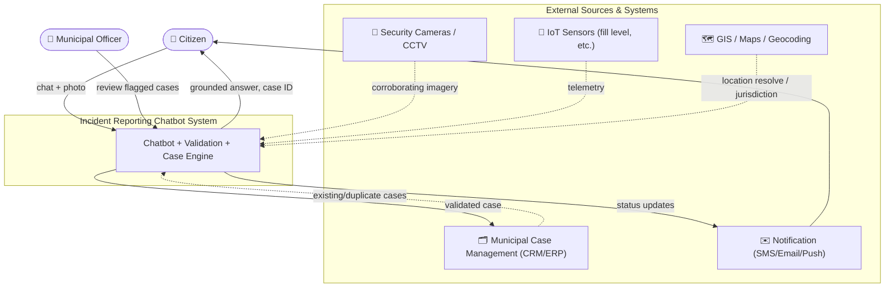
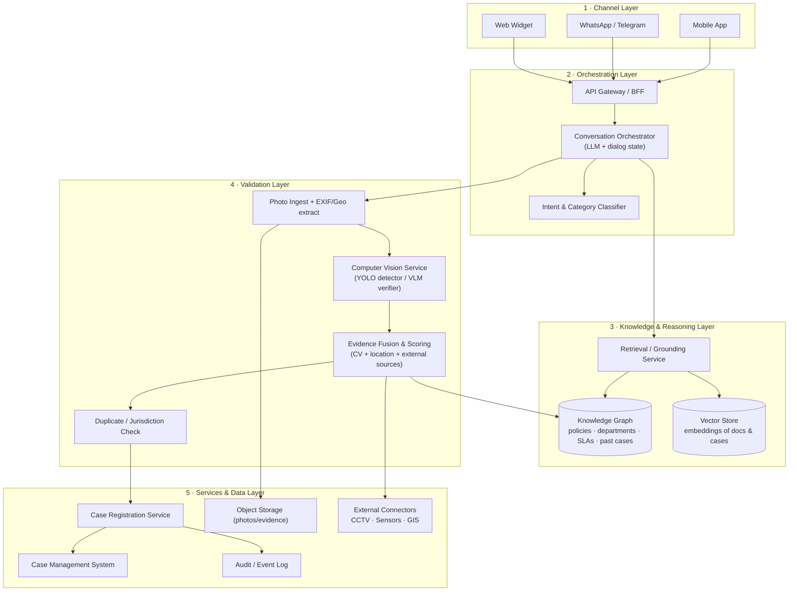
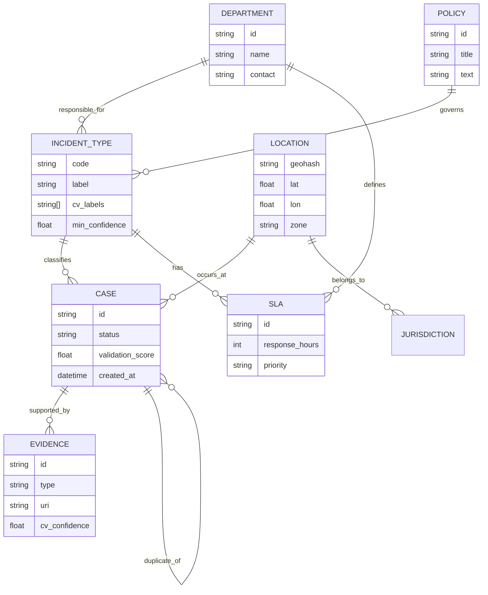

# 01 — Architecture

This document shows the architecture from four angles:

1. **System context** — who/what interacts with the system.
2. **Component architecture** — the internal building blocks.
3. **Validation sequence** — the end-to-end flow of one report.
4. **Data / knowledge model** — how information is stored and linked.

---

## 1. System Context Diagram



---

## 2. Component Architecture

The system is organized into five layers. Each box is an independently
replaceable component (see [03_how_to_modify.md](03_how_to_modify.md)).



---

## 3. Validation Sequence (one incident, end-to-end)

```mermaid
sequenceDiagram
    autonumber
    actor U as Citizen
    participant C as Chatbot Orchestrator
    participant K as Knowledge Graph (RAG)
    participant V as CV Service (YOLO/VLM)
    participant F as Evidence Fusion
    participant X as External Sources
    participant R as Case Service
    participant M as Case Mgmt System

    U->>C: "There's trash overflowing here" + photo
    C->>K: classify + retrieve policy/department/SLA
    K-->>C: category=Trash, dept=Sanitation, SLA=24h, similar cases
    C-->>U: Grounded reply (what happens next, expected SLA)

    C->>V: analyze photo (detect objects / verify claim)
    V-->>C: label=garbage_overflow, conf=0.91, bbox[...]

    C->>F: {category, CV result, GPS/EXIF, timestamp}
    F->>X: fetch CCTV frame + sensor fill-level near location
    X-->>F: CCTV image, bin fill = 96%
    F->>V: verify corroborating CCTV frame
    V-->>F: garbage_overflow conf=0.87
    F-->>C: validation = AUTO_VALIDATED (score 0.89)

    alt Auto-validated (high confidence)
        C->>R: register case (+evidence bundle, score)
        R->>M: create ticket → routed to Sanitation
        M-->>R: caseId = MUN-2026-014823
        R-->>C: caseId
        C-->>U: "✅ Case MUN-2026-014823 registered. ETA 24h."
    else Needs review (medium)
        C->>R: register case flagged FOR_REVIEW
        C-->>U: "🟡 Logged; an officer will verify shortly."
    else Rejected (low / duplicate / out of jurisdiction)
        C-->>U: "❌ Could not validate: <reason>. Here's what to do…"
    end
```

---

## 4. Knowledge Graph Model

The knowledge graph is the "brain" that turns a free-text complaint into a
routable, policy-aware action and grounds the chatbot's answers.



### How the layers map to concrete technology (example, swappable)

| Layer | Responsibility | Example tech (interchangeable) |
|-------|----------------|--------------------------------|
| Channel | Reach citizens | Web widget, WhatsApp Business API, Telegram |
| Orchestration | Dialog + routing | LLM (GPT/Claude/Llama) + LangGraph / Semantic Kernel |
| Intent classifier | Map text→category | Fine-tuned classifier or LLM function-calling |
| Knowledge graph | Grounding + routing | Neo4j / Azure Cosmos DB (Gremlin) / RDF store |
| Vector store | Semantic retrieval | pgvector / Azure AI Search / Pinecone |
| CV detector | Object detection | **YOLOv8/v11** (Ultralytics) |
| CV verifier | Claim verification | Vision-Language Model (GPT-4o / LLaVA / Florence-2) |
| Fusion & scoring | Combine signals | Rules + weighted score (or small ML model) |
| Case service | Register tickets | REST microservice |
| Case mgmt | System of record | ServiceNow / Dynamics 365 / custom |
| Storage | Evidence | S3 / Azure Blob |
| External | Corroboration | CCTV/VMS API, IoT hub, GIS/geocoder |

> The key idea: **each block talks through a defined interface**, so any one can
> be replaced without touching the others. See the next document for *why*.
