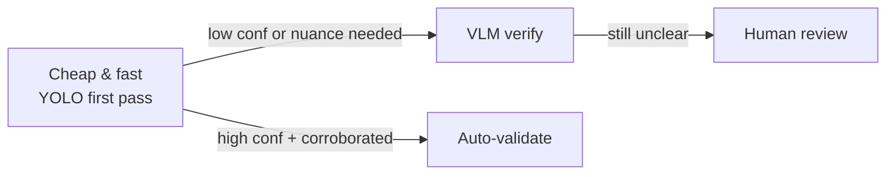

# 02 — Why This Architecture

This document explains the reasoning behind the design in
[01_architecture.md](01_architecture.md): the driving principles, why each major
decision was made, and what alternatives were rejected.

---

## Guiding Principles

1. **Trust through verification.** A municipality cannot dispatch crews on
   unverified reports. Validation is a *first-class* stage, not an afterthought.
2. **Grounded, not guessed.** Citizen-facing answers must come from a knowledge
   graph of real policies/departments/SLAs so the bot never invents rules.
3. **Loose coupling.** Every capability is a swappable component behind an
   interface, so the CV model, LLM, or case system can change independently.
4. **Human-in-the-loop for the gray zone.** Only high-confidence cases are fully
   automated; ambiguous ones are routed to officers.
5. **Evidence is auditable.** Every decision keeps the photo, CV output, external
   corroboration, and score for accountability and appeals.

---

## Key Decisions & Rationale

### 1. Why a **layered / modular** architecture (not a monolith)?

- Municipal requirements change often (new incident types, new departments,
  policy updates). Isolating change to one layer keeps the system maintainable.
- Different components have very different scaling and hardware needs — the CV
  service may need **GPUs**, while the chat orchestrator is I/O-bound. Separating
  them lets each scale independently.
- Vendors/models get replaced. Today YOLOv8; tomorrow a new detector or a VLM.
  A clean interface protects the rest of the system from that churn.

> **Rejected:** a single all-in-one app. Faster to prototype, but every model or
> policy change becomes a full redeploy and CV GPU load blocks the chat path.

### 2. Why a **Knowledge Graph** for grounding (not just an LLM)?

- Routing an incident requires **structured relationships**: incident type →
  responsible department → SLA → jurisdiction. Graphs model these naturally.
- It prevents hallucination: answers about SLAs, departments, and policy are
  **retrieved facts**, not generated guesses.
- It enables **duplicate detection and corroboration** by linking new cases to
  nearby/similar existing cases.

> **Rejected:** LLM-only "ask the model." Convenient but unreliable for policy,
> and it cannot enforce routing rules or dedup deterministically.
>
> **Complement, not replace:** a vector store handles fuzzy semantic search over
> documents/past cases; the graph handles exact relationships. Using both is why
> the design has *both* a KG and a vector DB.

### 3. Why **two-model computer vision** (YOLO detector + VLM verifier)?

- **YOLO** is fast and cheap and answers *"what objects are present and where"*
  (e.g. detects `vehicle`, `garbage_pile`, `crowd`). Great for high-volume
  first-pass detection and bounding boxes.
- **VLM (vision-language model)** answers *"does this image actually depict the
  claimed problem in context"* (e.g. "is this an *overflowing* bin vs a normal
  one?"). It handles nuance YOLO's fixed classes miss.
- Running YOLO first (cheap) and escalating to a VLM only when needed (or for the
  final claim check) balances **cost, latency, and accuracy**.

> **Rejected — detector only:** misses contextual/abstract judgments
> ("overcrowding", "abandoned"). **Rejected — VLM only:** slower and costlier per
> image, weaker at precise localization/counting. The combination is deliberate.

### 4. Why **evidence fusion** across location + external sources?

- A single photo is easy to fake, stage, or mislabel. Cross-checking with
  **CCTV, IoT sensors, GPS/EXIF, timestamp, and prior reports** dramatically
  raises confidence and filters spam/fraud.
- Fusion produces a single **validation score** with a clear threshold, giving
  transparent, tunable auto-approve / review / reject decisions.

> **Rejected:** trusting the citizen photo alone. Low cost but high false-positive
> rate → wasted crew dispatches and reduced public trust.

### 5. Why **confidence thresholds with human review** (not full automation)?

- Full automation on low-confidence cases risks dispatching on false reports;
  full manual review defeats the purpose of the bot.
- A tiered outcome (**auto / review / reject**) captures the value of automation
  while keeping a safety net for ambiguity and edge cases.

### 6. Why **channel abstraction** (web + WhatsApp + mobile)?

- Citizens use different channels; a thin channel layer over a shared
  orchestrator means one brain, many front doors — no logic duplication.

### 7. Why **object storage + audit log** for evidence?

- Photos and CV outputs must be retained for appeals, disputes, and analytics.
  Immutable storage + an event log make every case reproducible and defensible.

---

## Quality Attributes This Architecture Delivers

| Attribute | How it's achieved |
|-----------|-------------------|
| **Accuracy / trust** | Multi-source evidence fusion + two-stage CV |
| **Scalability** | CV, chat, and data layers scale independently |
| **Maintainability** | Swappable components behind interfaces |
| **Extensibility** | New incident types = KG entries + CV labels (no rewrite) |
| **Explainability** | Validation score + retained evidence bundle |
| **Resilience** | External sources are *optional* corroboration (system degrades gracefully to "needs review" if CCTV/sensors are down) |
| **Privacy/compliance** | Evidence isolated in storage; audit log; PII handled at channel edge |

---

## Cost / Latency Trade-offs (at a glance)

The pipeline is intentionally **cheapest-first**: most images are resolved by
YOLO + sensor/location checks; only the uncertain minority pay for VLM or human
time.

---

## Failure & Degradation Strategy

| If this fails… | System behavior |
|----------------|-----------------|
| CCTV / sensors unavailable | Skip corroboration → cap outcome at "needs review" |
| VLM unavailable | Fall back to YOLO-only score with lower auto-approve ceiling |
| Knowledge graph down | Serve cached policy/dept data; queue case creation |
| Case Mgmt System down | Persist case locally, retry with outbox pattern |

This is why external sources are drawn with **dashed lines** in the context
diagram — they *strengthen* a decision but are never a hard dependency.
