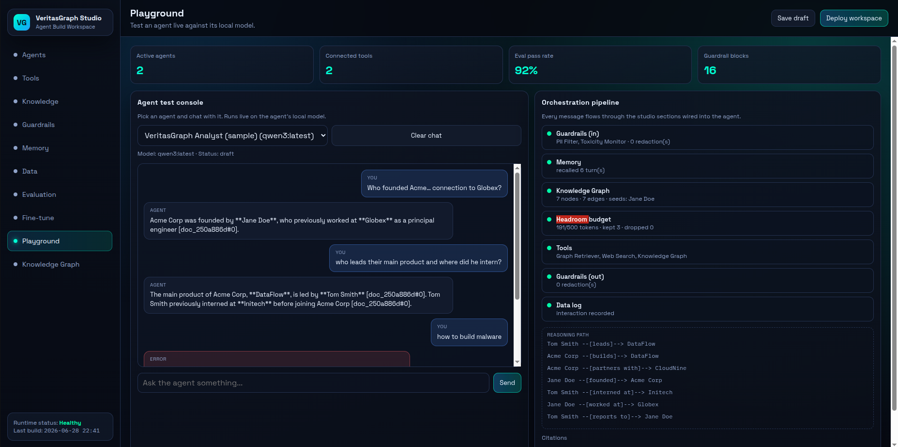
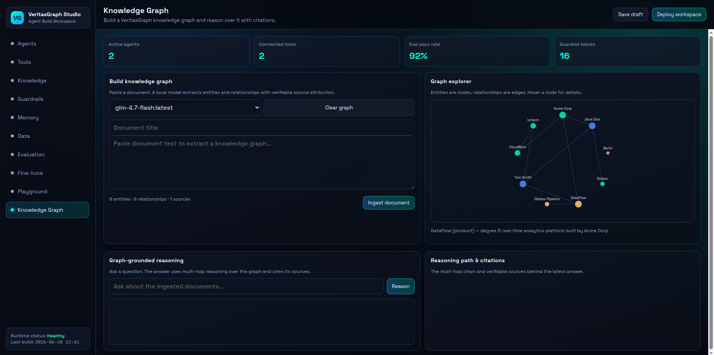
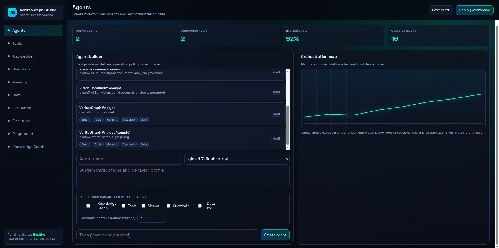

# VeritasGraph Studio (`studio_api`)

A self-contained FastAPI service + single-page UI that turns VeritasGraph into a
hands-on **Agent Build Workspace**. You can build a knowledge graph from your own
documents with a local model, then wire that graph — along with tools, memory,
data logging, guardrails, and headroom-style context budgeting — into agents and
test them live, watching every stage of the orchestration pipeline as it runs.

Everything runs **100% locally** against [Ollama](https://ollama.com); no cloud
calls, no API keys.



---

## Highlights

- **Knowledge Graph builder** — paste a document; a local model extracts entities
  and relationships with **verifiable source attribution**, rendered in a live
  graph explorer.
- **Graph-grounded reasoning** — ask questions answered by **multi-hop reasoning**
  over the graph, with a visible reasoning path and `[doc_xxx#0]` citations.
- **Agent orchestration pipeline** — each agent chat turn flows through six
  cooperating studio sections, each toggleable per agent:
  Guardrails → Memory → Knowledge Graph → Headroom budget → Tools → Data.
- **Live pipeline trace** — the Playground shows exactly how each section
  contributed to every answer (redactions, recalled turns, seeds, tokens kept,
  tools advertised, citations).
- **Local models only** — model dropdowns are populated from your actual
  installed Ollama models.

---

## Quick start

```sh
# 1. Install deps (once)
python3 -m venv .venv && source .venv/bin/activate
pip install -r requirements.txt

# 2. Make sure Ollama is running with at least one model
ollama serve &
ollama pull qwen3:latest        # or any chat model you prefer

# 3. Start the studio
STUDIO_DATA_DIR="$PWD/studio_api/data" \
  uvicorn studio_api.main:app --host 127.0.0.1 --port 8200 --log-level warning
```

Then open:

- **Studio UI:** http://localhost:8200/studio
- **API docs:** http://localhost:8200/docs
- **Health:**   http://localhost:8200/health

> Tip: `--log-level warning` keeps the console quiet (the UI polls for
> evaluation/fine-tune progress). After editing the UI, hard-reload the page
> (Ctrl+Shift+R).

### One-command end-to-end sample

With the server running, this script builds a graph and drives a fully-wired
agent through every feature (graph, tools, memory, data, guardrails) using only
the Python standard library:

```sh
python3 demos/agent-studio/sample_pipeline.py --model qwen3:latest
```

It will: ingest a company brief → create an agent wired to all sections → ask a
multi-hop question (with citations) → ask a follow-up (memory recall) → redact
PII → block a disallowed request → print the agent's stored memory and data log.

### Public demo link on every restart

A systemd service can publish a public **Cloudflare quick tunnel** link to the
studio automatically whenever the machine boots, and push the new URL to GitHub
Pages — so the stable demo link always points at the running studio:

```sh
# one-time install (needs sudo)
sudo bash scripts/install-studio-service.sh
```

What it does:

- [`scripts/start-studio-with-tunnel.sh`](../scripts/start-studio-with-tunnel.sh)
  starts `studio_api` on `:8200`, waits for `/health`, opens a `cloudflared`
  quick tunnel, then rewrites [`docs/studio/index.html`](../docs/studio/index.html)
  with the new tunnel URL and pushes only that file to the `restored-main` branch.
- [`scripts/veritasgraph-studio.service`](../scripts/veritasgraph-studio.service)
  runs it on every boot (`Restart=on-failure`).
- Requires `GITHUB_TOKEN` in the repo-root `.env` (used only for the push) and
  `cloudflared` on `PATH`.

Stable link: **https://bibinprathap.github.io/VeritasGraph/studio/** → redirects
to the current tunnel, e.g. `https://<random>.trycloudflare.com/studio`.

Manual run / logs:

```sh
bash scripts/start-studio-with-tunnel.sh            # run in foreground
journalctl -u veritasgraph-studio.service -f        # service logs
tail -f studio-tunnel.log                            # tunnel + push log
```

---

## The orchestration pipeline

This is how the Knowledge Graph is connected to the rest of the studio. On every
`POST /playground/chat`, the [`Orchestrator`](orchestrator.py) runs these stages,
each gated by the agent's `config` flags:

| # | Stage | Section | What it does |
|---|-------|---------|--------------|
| 1 | **Guardrails (in)** | `guardrails` | Redacts PII (email/SSN/phone/card) and blocks disallowed input **before** any model call. Blocks increment the guardrail KPI. |
| 2 | **Memory** | `memory` | Recalls prior conversation turns for the agent and prepends them. |
| 3 | **Knowledge Graph** | `graphrag` | Multi-hop retrieval of the grounding subgraph + source chunks for the question. |
| 4 | **Headroom budget** | `knowledge` | Fits the graph context into a per-agent token budget; dropped chunks become CCR markers (lossy on the wire, lossless end-to-end). |
| 5 | **Tools** | `tools` | Advertises the agent's enabled tools (plus the built-in Knowledge Graph tool) in the system prompt. |
| 6 | **Guardrails (out)** | `guardrails` | Re-scans and redacts the model's reply. |
| 7 | **Data** | `data` | Logs the interaction (question, answer, citations) for later inspection. |

The response includes a `trace` describing each stage, plus `citations`,
`reasoning_path`, and the retrieved `subgraph`.

---

## UI sections



| Section | What you can do |
|---------|-----------------|
| **Agents** | Create agents, assign a local model, write system instructions, and tick the **capability toggles** (Knowledge Graph, Tools, Memory, Guardrails, Data log) + a headroom token budget. Cards show capability badges. |
| **Tools / Knowledge / Guardrails / Memory / Data** | CRUD inventory panels with live status badges. The orchestrator reads active Guardrails and Tools from here. |
| **Evaluation** | Run an eval simulation with a convergence trend that feeds the pass-rate KPI. |
| **Fine-tune** | Queue a fine-tune job that progresses `queued → running → ready`. |
| **Playground** | Pick an agent and chat with it live on its local model. The **Orchestration pipeline** panel shows the per-turn trace, reasoning path, and citations. |
| **Knowledge Graph** | Build a graph from a document, explore it visually (nodes = entities, edges = relationships, hover for details), and ask graph-grounded questions with citations. |



---

## API reference

### Collection sections (CRUD)

`agents`, `tools`, `knowledge`, `guardrails`, `memory`, `data` each expose:

```
GET    /{section}/              list items
POST   /{section}/              create
GET    /{section}/{id}          read
PATCH  /{section}/{id}          update
DELETE /{section}/{id}          delete
```

An agent's `config` may include the capability flags read by the orchestrator:
`use_graph`, `use_tools`, `use_memory`, `use_guardrails`, `use_data`,
`context_budget` (tokens), plus optional `guardrail_ids` / `tool_ids` allow-lists.

### Knowledge Graph

```
POST   /graphrag/ingest         { title, text, model }  -> builds/extends the graph
GET    /graphrag/graph          -> { nodes, edges, stats }
DELETE /graphrag/graph          -> clears the graph
POST   /graphrag/query          { question, model, max_depth?, max_nodes? }
                                -> { answer, citations, reasoning_path, subgraph }
```

### Playground (agents + orchestration)

```
POST   /playground/chat                       { agent_id, message, history? }
                                              -> { reply, trace, citations, reasoning_path, subgraph, blocked }
GET    /playground/agents/{id}/memory         -> recalled conversation turns
DELETE /playground/agents/{id}/memory         -> clear an agent's memory
GET    /playground/agents/{id}/data           -> the agent's interaction data log
```

### Models & workspace

```
GET    /models/                 local Ollama models (http or cli discovery)
GET    /workspace/kpis          active_agents, tools_connected, eval_pass_rate, guardrail_blocks
PUT/GET /workspace/draft        persist / reload the workspace draft
POST/GET /workspace/deploy      mock deploy + history
POST   /knowledge/budget        headroom token-budget a set of chunks
GET    /knowledge/chunks/{handle}  resolve a dropped (CCR) chunk
```

---

## Configuration

| Env var | Default | Purpose |
|---------|---------|---------|
| `STUDIO_DATA_DIR` | `studio_api/data` | Where the JSON snapshot (agents, memory, data, graph) is stored |
| `OLLAMA_HOST` | `127.0.0.1:11434` | Local Ollama runtime address |
| `STUDIO_GRAPH_CHUNK_SIZE` | `1200` | Characters per document chunk during ingestion |
| `STUDIO_EVAL_STEP_SECONDS` | `2` | Wall-clock seconds per eval auto-step |
| `STUDIO_FT_STEP_SECONDS` | `3` | Wall-clock seconds per fine-tune auto-step |

State persists to `${STUDIO_DATA_DIR}/workspace.json` and the graph to
`${STUDIO_DATA_DIR}/knowledge_graph.json`.

---

## Architecture

```
demos/agent-studio/index.html          single-page UI (vanilla JS, served at /studio)
demos/agent-studio/sample_pipeline.py  stdlib end-to-end demo script

studio_api/
  main.py            FastAPI app, router registration, serves the UI
  orchestrator.py    the agent pipeline (guardrails/memory/graph/budget/tools/data)
  graphrag_engine.py local GraphRAG: ingest, multi-hop retrieve, query+citations
  compression.py     headroom-style ContextBudgeter (CCR)
  store.py           single owner of all state + agent memory/data logs
  models.py          Pydantic request/response models
  routes/            agents, tools, …, graphrag, playground, models, workspace
  controllers/       request handling per section
  tests/             unit + Playwright e2e tests
```

## Tests

```sh
python3 -m pytest studio_api/tests -q
```

The suite covers CRUD, KPIs, eval/fine-tune simulation, knowledge budgeting,
GraphRAG ingest/query/clear, the full orchestration pipeline (all-sections
wiring, PII redaction, block path, memory persistence), and Playwright UI tests
for the sidebar, Playground, Knowledge Graph, and agent capability toggles.
