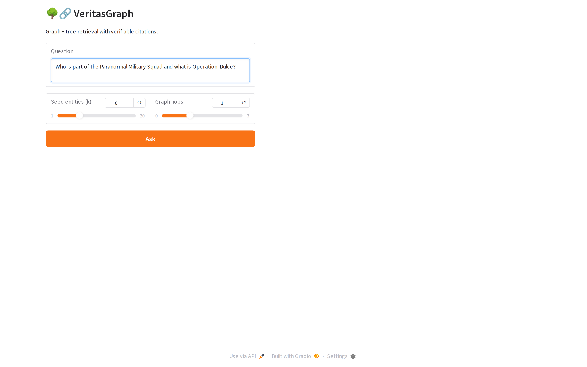

# VeritasGraph: Sovereign GraphRAG with Verifiable Attribution

> Combine the structure of a knowledge graph with PageIndex-style tree navigation
> to deliver multi-hop reasoning, 100% source attribution, and fully on-premise
> operation via Ollama.

VeritasGraph is a GraphRAG framework that builds a typed knowledge graph from
your documents, layers a hierarchical tree (table-of-contents) index on top, and
answers questions by traversing both — returning every claim with a verifiable
citation back to the originating chunk. It runs against OpenAI-compatible APIs
or 100% locally via Ollama.

<p align="center">
  
  &nbsp;
  
</p>

## 🚀 Features

- **Tree + Graph retrieval** — PageIndex-inspired hierarchical search combined
  with a typed property graph for multi-hop reasoning.
- **Verifiable attribution** — every answer ships with span-level citations
  pointing to the source chunk and graph path.
- **Local or cloud** — swap between OpenAI / Anthropic / Nebius and a fully
  on-premise stack (Ollama + LanceDB) via a single env var.
- **Visual graph explorer** — built-in Gradio UI with an interactive subgraph
  view of the entities and relationships used to answer each query.
- **Pluggable ingestion** — PDFs, web articles, transcripts, and structured
  YAML rules (e.g. SoD policies) out of the box.

## 🛠️ Tech Stack

- **Python 3.10+**
- **Gradio** – chat + graph explorer UI
- **Microsoft GraphRAG** – indexing & community detection
- **LanceDB** – embedded vector store
- **NetworkX** – graph traversal
- **Ollama** (local) or **OpenAI-compatible API** (cloud) – LLM + embeddings

## Workflow

```
Documents (PDF / URL / text)
        │
        ▼
chunk ─► LLM extract (entities + relationships + claims)
        │
        ▼
LanceDB embeddings  +  NetworkX property graph  +  Tree index
        │
question ─► tree narrow ─► graph traversal ─► grounded answer + citations
```

## 📦 Getting Started

### Prerequisites

- Python 3.10+
- One of:
  - An **OpenAI-compatible API key** (OpenAI, Nebius, Together, Groq, Azure…), or
  - [**Ollama**](https://ollama.com) running locally with `llama3.2` and
    `nomic-embed-text` pulled (`ollama pull llama3.2 && ollama pull nomic-embed-text`).

### Environment Variables

Copy `.env.example` to `.env` and fill in:

```env
# Cloud mode
OPENAI_API_KEY="sk-..."
OPENAI_MODEL="gpt-4o-mini"
OPENAI_EMBEDDING_MODEL="text-embedding-3-small"

# Local mode (Ollama)
OLLAMA_BASE_URL="http://localhost:11434"
OLLAMA_MODEL="llama3.2"
OLLAMA_EMBEDDING_MODEL="nomic-embed-text"
```

### Installation

```bash
git clone https://github.com/Arindam200/awesome-ai-apps.git
cd awesome-ai-apps/rag_apps/veritasgraph_rag
```

**Recommended – using [uv](https://github.com/astral-sh/uv):**

```bash
uv sync
```

**Alternative – using pip:**

```bash
python -m venv .venv
source .venv/bin/activate          # Windows: .venv\Scripts\activate
pip install -r requirements.txt
```

## ⚙️ Usage

1. Drop your source documents into `input/` (PDF, TXT, or Markdown).
2. Build the index:

   ```bash
   python -m veritasgraph_rag.ingest
   ```

3. Launch the chat + graph explorer:

   ```bash
   python app.py
   ```

   Then open <http://localhost:7860>:

   - **Chat tab** – ask a natural-language question. The app narrows the tree,
     traverses the graph, and returns an answer with inline `[source]` citations.
   - **Graph tab** – inspect the exact subgraph used to answer the most recent
     question.

### Switching modes

```bash
# Cloud (default)
export VERITAS_MODE=cloud && python app.py

# 100% local via Ollama
export VERITAS_MODE=local && python app.py
```

## 📂 Project Structure

```
veritasgraph_rag/
├── assets/                # screenshots / diagrams
├── input/                 # drop your source documents here
├── veritasgraph_rag/
│   ├── __init__.py
│   ├── ingest.py          # chunking, extraction, graph build
│   ├── retriever.py       # tree narrow + graph traversal
│   └── ui.py              # Gradio chat + graph explorer
├── app.py                 # entry point
├── requirements.txt
├── pyproject.toml
├── .env.example
└── README.md
```

## Notes & Limitations

- This folder is a **showcase** of VeritasGraph configured for the
  awesome-ai-apps collection. The full enterprise framework — including the
  MCP server, reasoning search, policy-compliance demo, and benchmarks —
  lives in the upstream repository:
  <https://github.com/bibinprathap/VeritasGraph>.
- Local mode works on CPU but a GPU is recommended for sub-second responses
  on graphs with > 5k entities.
- Citations are extracted from the graph traversal path; if the LLM ignores
  the supplied context the citation list will be empty (a guard rail rather
  than a silent failure).

## 🤝 Contributing

See the root [CONTRIBUTING.md](https://github.com/Arindam200/awesome-ai-apps/blob/main/CONTRIBUTING.md).

## 📄 License

MIT – see [LICENSE](https://github.com/Arindam200/awesome-ai-apps/blob/main/LICENSE).

## 🙏 Acknowledgments

- [Microsoft GraphRAG](https://github.com/microsoft/graphrag) for the indexing
  and community-detection foundation.
- [PageIndex](https://github.com/VectifyAI/PageIndex) for the hierarchical
  tree-navigation idea.
- [Ollama](https://ollama.com) for making local inference painless.
